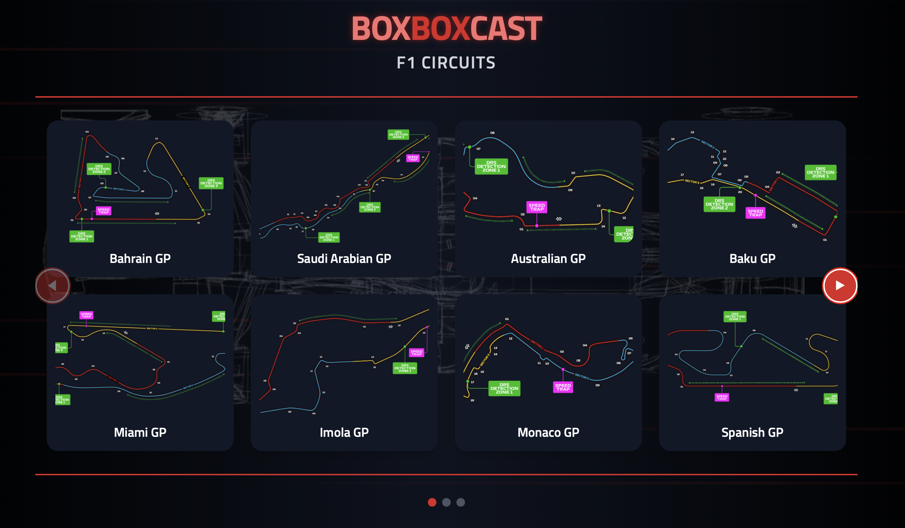
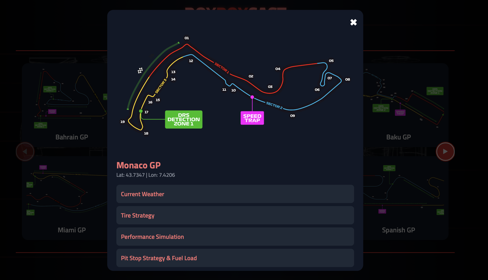

# 🏎️ BoxBoxCast

BoxBoxCast is a **Formula 1 weather & performance analysis app**.
It uses **FastAPI** (backend) and **React + TailwindCSS** (frontend) to fetch real-time weather via **OpenWeather API** and simulate car performance, DRS, and tire strategies dynamically.


##  Features
- **Live Weather Fetching** using FastAPI backend  
- **Performance Simulation** based on weather factors (grip, downforce, power)  
- **DRS (Drag Reduction System) Integration** with realistic lap time boost  
- **Dynamic Tire Recommendations** (Soft, Medium, Hard, Intermediates, Full Wets)  
- **Pit Stop & Fuel Strategy Suggestions**  
- Modern UI built with **React + TailwindCSS**  
- Fully functional **FastAPI backend** serving data to frontend  

##  Installation & Usage

### 🔹 Step 1: Clone the Repository
Run the following commands to clone and navigate to the project folder:
```bash
git clone https://github.com/aaisha077/BoxBoxCast.git
cd BoxBoxCast
```
### 🔹 Step 2: Backend Setup (FastAPI)
Set up and run the FastAPI backend with:

```bash
cd backend
python3 -m venv venv
source venv/bin/activate   # For Mac/Linux
venv\Scripts\activate      # For Windows
pip install -r requirements.txt
uvicorn main:app --reload
```
➡️ Backend will run on: http://127.0.0.1:8000

### 🔹 Step 3: Frontend Setup (React)
Set up and run the React frontend with:

```bash
cd frontend
npm install
npm start
```
➡️ Frontend will run on: http://localhost:3000

🖥️ How to Use

1. Open the frontend in your browser.
2. Select a circuit to view live weather conditions.
3. Toggle DRS in performance simulation for dry tracks.
4. Get recommended tires, lap time predictions, and strategy suggestions.

## 📸 Screenshots

### Home Page


### Weather & Performance Analysis

